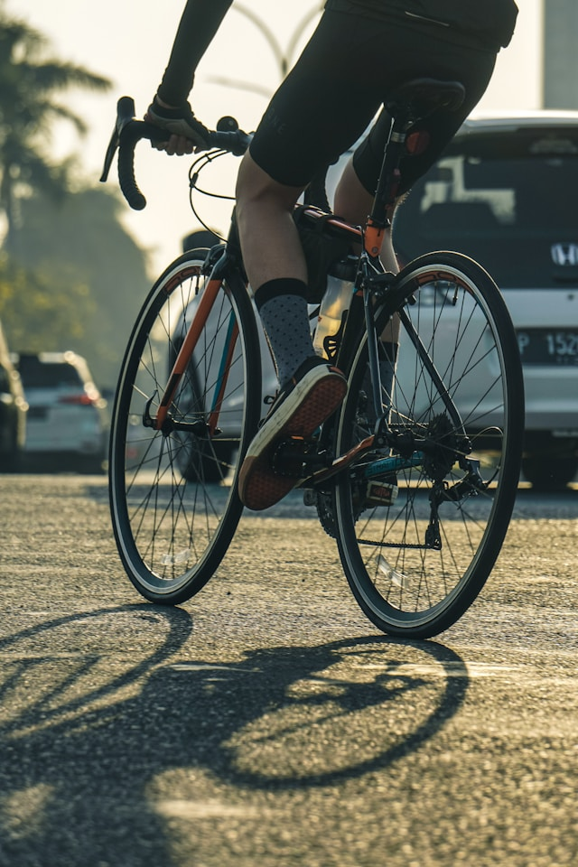

When hitting the road on your bike, having the right clothing is just as important as having the right bike – for comfort, safety, and performance. Here’s a quick guide on what you really need and where to find it.

## Helmet and Glasses: Safety First

The bike helmet is your most important safety accessory. Designs and technology have come a long way, making helmets both protective and stylish. Trusted brands like Abus, Kask, Rudy Project, Giro, and Specialized offer certified models. It’s important the helmet fits well, so buying from a specialist store is recommended. Used helmets are not advised due to material fatigue risks. You can usually find the production date inside the helmet.

Sport sunglasses not only add style but also protect your eyes from insects and debris that can fly into your face while riding. For beginners, simple sport or lab glasses like Uvex work perfectly fine.

## Clothing: Comfort for Long Rides

The bib shorts with padding are the core of cycling clothing, providing comfort on longer rides. Pair them with a breathable cycling jersey featuring handy rear pockets.

For changeable weather, a lightweight rain jacket is recommended. Jackets with PTFE membranes are waterproof and breathable, but the material is controversial due to environmental concerns. We suggest opting for simpler jackets with PU coatings instead — less functional but more sustainable.

For cooler days, baselayers or functional shirts are useful, for example from Decathlon Kipsta. You can also add long cycling tights, leg warmers, and warm long-sleeve jerseys or jackets. Gloves protect your hands from abrasions in summer and keep them warm in winter.

## Cycling Shoes: Efficiency and Control

Once you’re beyond the beginner stage, you’ll quickly realize the importance of cycling shoes. Connected to clipless pedals (cleats), they allow for more efficient power transfer. The Shimano SPD-MTB system is a great choice for beginners since the shoes have tread, allowing you to walk comfortably off the bike.

## Where to Shop?

Decathlon offers great value-for-money cycling clothing for beginners.

You can also find good deals on secondhand platforms like Vinted or Amazon. Just make sure to choose established cycling brands such as Castelli, Sportful, Nalini, Kalas, Craft, Etxeondo, Biehler, Assos, Alé, Gobik, Bioracer, Santini, dhb, Van Rysel, B'Twin, Triban and others — functionality is key.

## Club Kits

Our club also offers its own kits...
