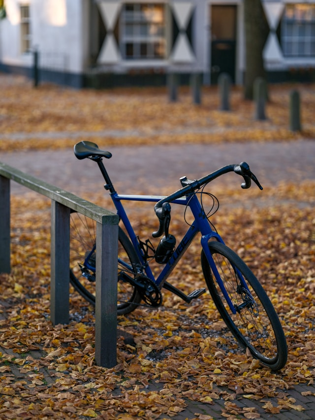

When you're new to cycling, it’s tempting to go straight for the sleek carbon bikes you see in races and ads. But here’s the truth: **aluminum is your friend** when you’re starting out.

## Why Not Carbon?

Carbon frames offer incredible performance, no doubt. But carbon is a more brittle material and not ideal if you're still developing your handling skills or learning how to care for a bike. A crash, a fall, or even overtightening a clamp can damage a carbon frame. **Modern aluminum frames**, on the other hand, are excellent in quality, far more forgiving, and often cheaper.

**Steel frames?** They're charming and durable but heavy. Not ideal for road cycling or performance riding.

Also, avoid bikes that are too old. Besides wear and tear, **technology in bikes has evolved rapidly**, making newer models safer, lighter, and more efficient.

## Frame Size & Setup

Getting the **right frame size** is crucial. A bike that’s too big or too small will be uncomfortable and inefficient. If in doubt, most major brands (like Canyon or Giant) offer **online size calculators**.

One great example of a beginner-friendly setup is the **Canyon Endurace AllRoad** – modern geometry, solid components, and a trusted manufacturer.

## Buying on a Budget

If you're on a tight budget, here’s where you can safely save money:

- **Rim brakes** instead of disc brakes
- **Quick-release wheels** instead of thru-axles
- **Used bikes** from trusted sellers

Look for a used bike with:

- A **reputable brand** (e.g., Canyon, Scott, Trek, Specialized, Giant, Cube, BMC, Cannondale, Ribble, etc.)
- **Aluminum frame**
- **Shimano 105 or Ultegra** drivetrain (or CUES/SRAM equivalent)
- **Good condition**, no cracks, rust, or worn-out drivetrain parts

If you’re unsure, ask a knowledgeable friend to help evaluate the bike. Buying used without experience is risky, and what looks like a bargain can quickly turn into an expensive repair project.

The good news: **quality bikes hold their value well**, so resale is always an option.

### Road, Gravel, or MTB?

This is where many get stuck. So here’s a quick guide:

### Endurance vs Race Road Bikes

- **Endurance** geometry is more relaxed and beginner-friendly.
- **Race** geometry is aggressive and not ideal for long rides if you're not flexible or experienced.

#### Gravel Bikes

Gravel bikes are the trendy "do-it-all" machines. They ride well on tarmac, gravel, and light trails. Great for adventure, commuting, and training.

### Hardtail MTB – The Sleeper Pick

For those on a tight budget or who want one bike for many uses, a **hardtail mountain bike** is a solid choice:

- Robust and forgiving (no delicate carbon fork)
- Works for commuting, XC rides, gravel paths, and even mild trails
- Easy to find high-quality models at low prices, especially used
- Higher handlebar position = better visibility and control in traffic

**Downsides:** heavier, less aerodynamic, and slower on group road rides. Still, a great way to start the sport without breaking the bank.

> *Personally, I’d pick a road bike or XC MTB over a gravel bike, but it’s really a lifestyle choice at the end of the day.*

## Final Thoughts

Buying a new bike is one of the most exciting parts of getting into cycling – but it’s easy to overthink. Go for a reliable, modern aluminum bike that fits your budget and riding style. Don’t get caught up in the hype around gear and accessories.

Need help? We’re happy to assist you in finding the right bike.
