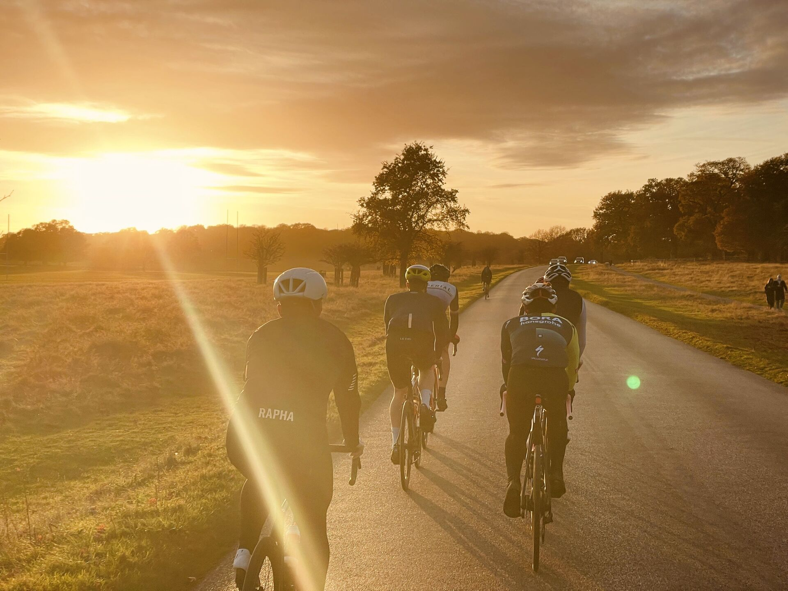

This post explains how to write and publish a blog post on the ICCC Hub. Everything is written in **Markdown** — a simple text format that Hugo converts to HTML automatically.

## Folder Structure

Every post lives in its own folder under `content/posts/`. The main file must always be named `index.md`. Images go directly in the folder or in an `images/` subfolder.

```
content/posts/
└── my-post/
    ├── index.md          ← must be named index.md
    ├── cover.jpg
    └── images/
        ├── photo1.jpg
        └── photo2.jpg
```

Hugo generates the URL automatically from the folder name: `my-post` → `/posts/my-post/`. Use hyphens, no spaces or special characters.

---

## Frontmatter

Every post starts with a frontmatter block at the top of `index.md`. Copy this template:

```
---
title: "Your Post Title"
date: 2025-06-01
author: "Your Name"
tags: ["Road", "Beginners"]
summary: "One sentence shown in the blog list and on the Hub."
---
```

- `title` — shown everywhere. Runs through Markdown formatting, so `**bold**` works if you want to emphasise part of a title (useful for news items with a date, see the news guide)
- `date` — controls sort order, format `YYYY-MM-DD`. **Must be today or in the past** — posts with a future date will not be rendered until that date arrives.
- `author` — shown in the byline. If a matching profile exists under `content/authors/`, the name links to it automatically. If not, it's just shown as plain text — no error, nothing to set up, so generic authors like "ICCC" work fine without a profile.
- `tags` — shown as small pill badges above the title on the post, the list, and the Hub homepage. All tags are shown (not just the first one), and on the post itself each tag links to a page listing everything with that tag (e.g. `/tags/road/`)
- `summary` — shown as excerpt in blog list, keep it under 160 characters. Also used as the page's meta description for search engines and social media previews — don't skip it.

### Social Media Preview Image

By default, all posts use a shared fallback image when shared on social media. To use a specific image for a post, add `og_image` to the frontmatter pointing to an image in your post folder:

```
---
title: "Your Post Title"
date: 2025-06-01
og_image: "images/preview.jpg"
---
```

If omitted, the default `og-image.jpg` from `static/` is used.

### News Posts

For **news posts** under `content/news/`, one additional field is available:

**Expiry date** — the item stays visible but appears greyed out in the news list once it passes:

```
expires_on: "2025-10-02"
```

See the dedicated news guide for details — there used to be an `event_date` field too, but that's been retired in favour of just writing the date into the title.

---

## Headings

```
## H2 — Main section heading
### H3 — Subsection
#### H4 — Sub-subsection
##### H5 — Label style (blue, uppercase)
###### H6 — Subtle label (grey, uppercase)
```

## H2 — Main section heading
### H3 — Subsection
#### H4 — Sub-subsection
##### H5 — Label style
###### H6 — Subtle label

---

## Text Formatting

```
**Bold text**
*Italic text*
~~Strikethrough~~
`inline code`
```

**Bold text** — use for key terms and important points.
*Italic text* — use for emphasis or titles.
`inline code` — use for technical terms or file names.

---

## Lists

Unordered:
```
- First item
- Second item
- Third item
```

- First item
- Second item
- Third item

Ordered:
```
1. First step
2. Second step
3. Third step
```

1. First step
2. Second step
3. Third step

---

## Blockquote

```
> This is a quote or callout. Use it for tips, warnings, or notable quotes.
```

> This is a quote or callout. Use it for tips, warnings, or notable quotes.

---

## Links

```
[Link text](https://example.com)
[Email us](mailto:cycle@imperial.ac.uk)
```

[Link text](https://example.com) — opens in same tab.
[Email us](mailto:cycle@imperial.ac.uk) — opens mail client.

---

## Images

Place images in your post folder or in an `images/` subfolder:

```
content/posts/my-post/
├── index.md
└── images/
    ├── richmond.jpg
    └── richmond2.jpg
```

**Without caption** — standard Markdown, always full width:

```

```


**With caption** — use the `fig` shortcode:

```

```



**With caption and custom width** — add a `width` parameter (always centred):

```

```



Width accepts any CSS value: `50%`, `300px`, `40rem` etc.

---

## Horizontal Rule

Use `---` on its own line to create a divider.

---

## Embedding a YouTube Video

Use the `yt` shortcode. Copy the video ID from the YouTube URL — it's the part after `v=`:

```
https://www.youtube.com/watch?v=dQw4w9WgXcQ
                                ^^^^^^^^^^^^ this part
```

```

```



For privacy, this doesn't embed YouTube directly. Visitors first see a plain black box with a play button and a short note — nothing is loaded from YouTube (not even a thumbnail) until they click. Only then does the actual `youtube-nocookie.com` player load.
